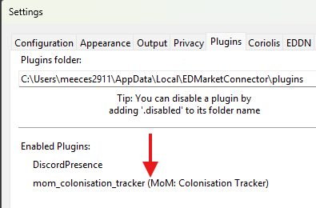

# Mercs of Mikunn: Colonisation Tracker Plugin

This [EDMC](https://github.com/EDCD/EDMarketConnector) plugin is designed to help any Mercs particpating in the building of the Grand Tiberian Highway by doing most of the admin work of keeping the spreadsheet updated for you.

## Installation Instructions
1. Install [EDMC](https://github.com/EDCD/EDMarketConnector/releases) if you haven't already done so
1. Configure EDMC with some required settings
   - On the Configuration tab, ensure **Enable Fleet Carrier CAPI Queries** is selected (important for Carrier owners)
   - On the Output tab, ensure **Automatically update on docking** is selected
1. On the Plugins tab ios a button to quickly open the EDMC plugins folder - click that 😉 (or at the very least, note the plugins folder path)
   > There are some reports of this not being populted, or the button not working on Linux/Steam Deck. See EDMCs [More-Info](https://github.com/EDCD/EDMarketConnector/wiki/Plugins#more-info) for the default locations
1. Download the latest plugin from [Releases](https://github.com/meeces2911/edmc-mom-colonisation-plugin/releases/latest)
1. Extract the zip file to the location noted in step 3
   > The folder structure should look like: **EDMarketConnector\plugins\mom_colonisation_tracker\load.py**
1. Save and close the EDMC settings dialog if you haven't already
1. If the Frontier OAuth screen has appeared, sign into that and confirm access
1. Close and **restart** EDMC
1. A Google OAuth screen should open in your web browser, sign into that and confirm access
   > There are some reports of this page not loading correctly on Linux/Steam Deck if the browser isn't already open. To work around this, make sure the default web browser is open before launching EDMC. The OAuth screen should then open in a new tab.
1. A second Google screen should open, asking you to pick the **MERC Expantion Needs** sheet. Select that and confirm access.

## Troubleshooting
- Check the plugin is installed correctly.
   - After restarting EDMC, you can go back into Settings and select the Plugins tab. You should now see **mom_colonisation_tracker (MoM: Colonisation Tracker)** included under the list of Enabled Plugins.
      
      

- If the plugin has loaded successfully, you should bee an extra **MoM: Colonisation Tracker** tab.
   

- If the plugin is running, but dont doing something correctly, try changing the Log Level on the first **Configuration** tab to DEBUG, reproduce the issue, and then send me the log file to look at. (or check it out yourself... I'm logging *quite* a bit 😜)
   - You can click the **Open Log Folder** button for a quick shortcut to get to the logs folder.
      